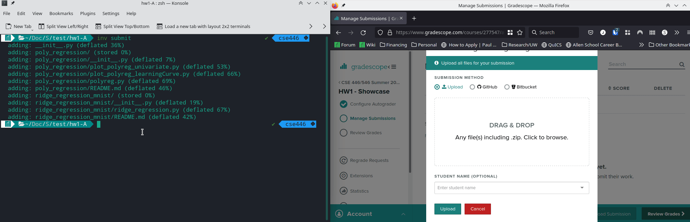

# 546-hw-base

This is the base repository for CSEP 546 homeworks. To save disk space and keep your environment consistent, we recommend a structure where all homeworks share a single virtual environment located in your `hw0` or root directory.

### Recommended Directory Structure
```text
csep546-coding/
├── .venv          (Symlink to hw0/.venv)
├── hw0/           (This repository)
│   └── .venv/     (The actual environment)
└── hw1/           (Future homework)
```

# Reading Markdown files
Before you start doing anything, please make sure you have a proper way of reading markdown files.
You can use any tool you would like for it.
Python IDEs that we recommend for this class (VSCode or PyCharm) come with Markdown readers built-in.


# Setup

**You only need to perform this set up once**. We will use `uv` to manage your Python environment.

This set up should be compatible with macOS, Linux, and Windows.

If you want to, you can do this on the `attu` instructional servers (given that you have enough storage space left in your quota).

## 1. `uv` installation
`uv` is a fast Python package installer and resolver. Install it by running the following command in your terminal: 

You can install `uv` by following the instructions at [https://github.com/astral-sh/uv](https://github.com/astral-sh/uv), or simply running the following command in your terminal:

### macOS / Linux:
```bash
curl -LsSf https://astral.sh/uv/install.sh | sh
```

### Windows (PowerShell):
```powershell
powershell -ExecutionPolicy ByPass -c "irm [https://astral.sh/uv/install.ps1](https://astral.sh/uv/install.ps1) | iex"
```

## 2. Environment Setup
First make sure you have at least ~5GB of free drive.
Then, from the hw0 directory, run:
```bash
uv sync
```

## 3. Creating a Symlink (Recommended)
To allow your IDE (like VSCode) to find your Python interpreter when you open the top-level csep546-coding folder, create a symbolic link:

### macOS / Linux:
```bash
# From inside the hw0 directory:
ln -s .venv ../.venv
```

### Windows (Run PowerShell as Administrator):
```PowerShell
# From inside the hw0 directory:
New-Item -ItemType SymbolicLink -Path "..\.venv" -Target ".venv"
```

# Working on Homeworks
Whenever you return to work on your assignments, you can run commands directly using `uv run`, or activate the environment manually:

### macOS/Linux:
```bash
source .venv/bin/activate
```

## Windows:
```powershell
.venv\Scripts\activate
```

If you are in a future homework folder (e.g., hw1), you can point your IDE to the interpreter located in ../.venv.

# Usage

## Submission

When you are done with coding run.
```
inv submit
```
this will generate a `.zip` file that should be uploaded to gradescope for automated grading.

For example running:
```
inv submit
```
will result in `submission_<timestamp>.zip` generated, which should be submitted under corresponding homework coding assignment on gradescope.



Note that if you do get a lot of `NotImplementedError("Your Code Goes Here")` errors when submitting to gradescope you .zip file might be in an improper format which makes autograder unable to detect it. **MAKE SURE TO USE `inv submit` if that happens.


## Testing
In this class we will use unittest framework in python to automatically grade coding problems.
Some of the tests are provided to you, so that you can validate your results.

To run tests:
```
inv test
```

The output should look something like this:
```
> inv test

FFF..
======================================================================
FAIL: test_polyfeatures_fives (public.poly_regression.test_poly_regression.TestPolyReg)
----------------------------------------------------------------------
Traceback (most recent call last):
  File ...
AssertionError: 
Arrays are not almost equal to 6 decimals

(shapes (1,), (20, 1) mismatch)
 x: array([1.])
 y: array([[5.],
       [5.],
       [5.],...
```

You can see that in the top there are 3 `F`'s and 2 `.`'s. `F`'s correspond to failed tests and `.` correspond to correct tests.

There are few things to note:

- Not all tests are equal. Some are worth more points. This will not be displayed when you run `inv test`.
- We **do not** provide you with all tests. There are many that hidden. Even if you pass all *public* tests you may still fail some *hidden* ones. We recommend submitting your code to Gradescope early and often so you can check the autograder score before the deadline, in case you would like to resubmit.

### Testing specific problem
Unfortunately the `unittest` framework doesn't allow for testing specific file.
However, you can run tests against specific problem, using the problem's directory name.
To do so run:
```
inv test --problem <problem-name>
```
For example:
```
> inv test --problem poly_regression

test_fit_and_predict_cubic (test_poly_regression.TestPolyReg) ... ok
test_fit_and_predict_straight_line (test_poly_regression.TestPolyReg) ... ok
test_fit_cubic (test_poly_regression.TestPolyReg) ... ok
test_fit_hard (test_poly_regression.TestPolyReg) ... ok
test_fit_linear (test_poly_regression.TestPolyReg) ... ok
test_fit_straight_line (test_poly_regression.TestPolyReg) ... ok
test_mean_squared_error (test_poly_regression.TestPolyReg) ... ok
test_polyfeatures_fives (test_poly_regression.TestPolyReg) ... ok
test_polyfeatures_ones (test_poly_regression.TestPolyReg) ... ok
test_polyfeatures_twos (test_poly_regression.TestPolyReg) ... ok

----------------------------------------------------------------------
Ran 10 tests in 0.197s

OK
```

## Linting

Linting is **not required** for this class.
However, it can be helpful to keep your code linted, especially if this is your first time learning python or if you never had a formal introduction.

For this we provided you with a simple script to track issues & possibly fix your code.
To run linter:
```
inv lint
```
which will generate output
```
> inv lint
flake8 homeworks
homeworks/hw1/poly_regression/polyreg.py:103:5: E303 too many blank lines (4)
```
You can see that issue points to file (`polyreg.py`), line (105) and column (3) as well as the issue "too many blank lines".

Note that we are using 4 linters (flake8, isort, black, mypy; in that order).
If you have issues that are pointed out by isort or black you can run `inv lint --apply` to automatically apply fixes.

Again, linting is **not required** for this class.
If you don't want to lint your code, or prefer some other linting setup that's ok!
